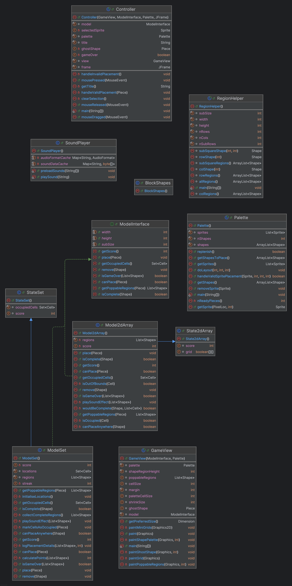

# Block Puzzle Lab Report

## 1. Design

The implementation of my block puzzle game is structured around the Model-View-Controller (MVC) design pattern ensuring a clear separation of responsibilities. The `ModelSet` and `Model2dArray` classes implement the `ModelInterface` to encapsulate the game logic, while the`Controller` class manages game flow and user interaction.`GameView` handles the rendering of the game.

### Implementation Choices:

1. **Models:**
    - **ModelSet:**
        - **Pros:** Efficient for sparse grids as it only stores filled cells, reducing memory usage.
        - **Cons:** Computationally expensive for operations requiring access to all cells, such as validating rows and columns for poppable regions, as each cell must be individually checked.
    - **Model2dArray:**
        - **Pros:** Ideal for dense grids, with direct index-based access to cells, enabling faster operations like row and column validation.
        - **Cons:** Higher memory consumption due to the need to store all cells, even if many are empty.

   Both models pass all unit tests, ensuring adherence to the specifications.

2. **Controller:**
    - The `Controller` class serves as a central hub, managing interactions between the model and view. Its high coupling highlights its central role but also reveals opportunities for refactoring.
3. **Additions:**
    - **Combo Scoring:** Players receive extra points for clearing multiple rows, columns, or regions simultaneously.
    - **Streak Multipliers:** Rewards consecutive pops with increasing score bonuses.
    - **Immersive Experience:** Sound effects have been integrated for placing pieces, clearing regions, and achieving streaks.

---

## 2. Software Metrics

Metrics were analysed using IntelliJ's Metrics-Reloaded plugin. The following metrics were referenced based on course material:

### Key Metrics:

1. **Lines of Code (LoC):**
    - Average Total Lines: 102 per file.
    - Maximum Lines: 177 (in `Controller`), indicating opportunities for modularization.
    - Files with fewer lines (<50) were reviewed to ensure they fulfil a clear and focused purpose.

   **Figure:** The `Controller` class contains 177 lines, with 154 non-empty lines, justifying a closer review for potential refactoring.

2. **Cyclomatic Complexity:**
    - Many methods, such as `blocks.BlockShapes.Piece.cells()`, exhibit low complexity (`v(G) = 1`), indicating simple logic.
    - Higher complexity is observed in `Controller` methods (`v(G)` up to 5), reflecting the coordination of gameplay and user interactions.

   **Figure:** The average `v(G)` across the project is 1.5, with complex methods concentrated in `Controller`.

3. **Coupling:**
    - The `Controller` class has high coupling, reflecting dependencies on multiple classes. While this is appropriate for its role, modularization could reduce unnecessary dependencies and simplify testing.

   **Figure:** The average Coupling Between Objects (CBO) across the codebase is 3, with `Controller` reaching 8.

4. **Cohesion:**
    - The `ModelSet` and `Model2dArray` classes exhibit high cohesion, with related methods working closely together to enforce game rules and manage state.
    - Low cohesion in `Controller` highlights opportunities to delegate responsibilities to helper classes.

---

## 3. OO Design Principles

This project adheres to several Object-Oriented (OO) design principles:

1. **Keep It Simple (KISS):**
    - Logical models (`ModelSet` and `Model2dArray`) were designed with simplicity in mind, ensuring readability and maintainability.
2. **Don't Repeat Yourself (DRY):**
    - Shared logic between `ModelSet` and `Model2dArray` was abstracted into utility methods where possible, minimizing duplication.
3. **SOLID Principles:**
    - **Single Responsibility Principle (SRP):** Each class has a clear responsibility (e.g., `ModelSet` handles state management, `Controller` handles user interaction).
    - **Open/Closed Principle (OCP):** New features, such as streak scoring, were added without modifying the core logic, ensuring extensibility.
    - **Liskov Substitution Principle (LSP):** Both `ModelSet` and `Model2dArray` can seamlessly replace `ModelInterface` implementations.
    - **Interface Segregation Principle (ISP):** The `ModelInterface` provides a streamlined API, ensuring clarity and focused design.
    - **Dependency Inversion Principle (DIP):** The design emphasizes abstractions, reducing dependence on concrete implementations.
4. **Tangram Puzzle Exercise:**
    - This game follows a modular approach similar to solving a tangram puzzle, with distinct components coming together to form a cohesive whole. The `Controller` acts as the "solver," orchestrating the placement of pieces while the `Model` ensures logical integrity.

---

## 4. Game

The block puzzle game is a hybrid of Tetris and Sudoku, featuring:

- **Gameplay Mechanics:**
    - Drag and drop shapes from the palette to the grid.
    - Complete rows, columns, or 3x3 regions to clear them and earn points.
    - Combos reward simultaneous clears, while streak multipliers boost consecutive clears.
    - Sound effects enhance immersion by providing auditory feedback for key actions.
- **Features Implemented:**
    - **Ghost Shape:** Displays where a shape will land if placed, enhancing usability.
    - **Combo Scoring:** Adds bonus points for clearing multiple regions in one move.
    - **Streak Scoring:** Multiplies points for clearing regions consecutively.
    - **Game Over Detection:** Ends the game when no valid moves remain.

### Screenshots:

1. Dragging a piece from the palette to a valid position.
2. Highlighting poppable regions before placement.
3. Updated grid and refreshed palette after clearing a region.

---

## 5. Conclusion

### Observations:

1. **Strengths:**
    - The use of MVC ensures a clear separation of concerns.
    - High cohesion in logical models (`ModelSet` and `Model2dArray`) contributes to code clarity.
    - Gameplay features like combos, streak scoring, and sound effects enhance user engagement.
2. **Improvements:**
    - Simplify complex methods in `Controller` to improve readability and reduce cyclomatic complexity.
    - Reduce coupling by delegating responsibilities to helper classes.
    - Balance file sizes to avoid overly large or small files.
3. **Reflection:**
    - Java’s strong typing and extensive libraries made it suitable for this project. However, its verbosity can be limiting compared to other languages like Python.

### Final Thoughts:

This project meets the assignment requirements, combining thoughtful design with engaging gameplay. Future iterations could explore GUI alternatives (e.g., JavaFX) and AI-driven features such as a random play mode.

---

## Glossary

- **Lines of Code (`LoC`):** Measures the size of a codebase in terms of the number of lines, distinguishing between total and non-empty lines.
- **Cyclomatic Complexity (`v(G)`):** Indicates the number of independent paths through a method, reflecting its complexity.
- **Coupling:** Refers to the degree to which a class depends on other classes. Lower coupling improves modularity and testability.
- **Cohesion:** Reflects how closely related the methods in a class are. High cohesion indicates that a class is focused on a single responsibility.

---

